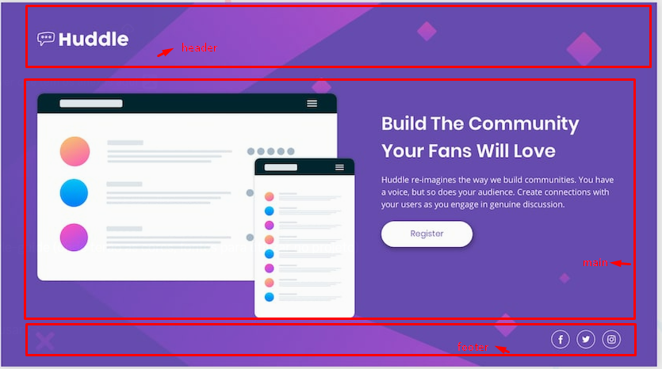

# Front-end Style Guide

# NÃO É NECESSÁRIO O USO DO GRID NESTE PROJETO, FACILITE

# Como eu organizo o projeto?

## Cores para serem usadas no projeto 

- Violet: hsl(257, 40%, 49%);
- Soft Magenta: hsl(300, 69%, 71%);

## Icones
- [Icones do FontAwesome](hsearchttps://fontawesome.com/v5/)
- [Font Awesome](https://fontawesome.com/)

